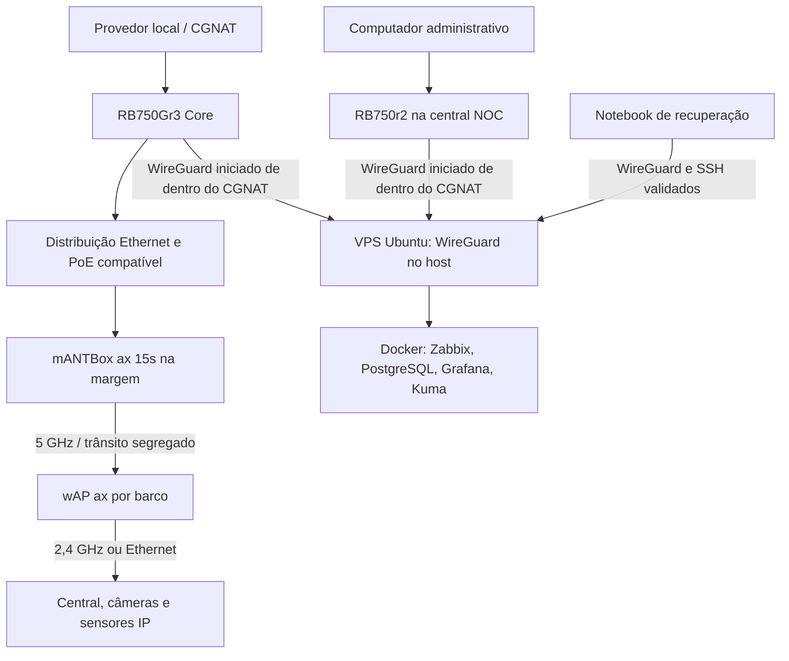

# Arquitetura da solução

Estado em 16/09/2026: stack NOC instalada na VPS e coleta interna concluída; hub WireGuard e notebook implantados, com SSH confirmado. VPN do core, rede de campo e homologação integral continuam pendentes; a VPN da RB750r2 foi confirmada funcional pelo usuário em 22/09/2026. Ver [registro da fase](../06-validation/VPS_PHASE_COMPLETION.md), [contexto](../00-project/CONTEXT.md) e [plano de rede](NETWORK_PLAN.md).

## Topologia de destino e caminho já implantado

As setas representam conexões, não exclusividade de direção do tráfego. Os caminhos notebook ↔ VPS, RB750r2 ↔ VPS e a stack têm implantação registrada; o enlace do core e o campo permanecem topologia de destino. Não há encaminhamento permanente de vídeo pela VPS.

A central NOC é o local administrativo com a RB750r2; os serviços de monitoramento são hospedados na VPS. A RB750r2 está atualizada para 7.23.7 e opera como gateway; inventário recebido em 21/09/2026 e VPN WireGuard funcional confirmada pelo usuário em 22/09/2026. Rotas de LAN, serviços administrativos e failover permanecem pendentes.

## Responsabilidades

| Elemento | Responsabilidades | Dependências |
|---|---|---|
| VPS/host | Terminar VPN, rotear gerência, firewall e sistema | Provedor VPS e IP público |
| Zabbix | Coletar, armazenar métricas e avaliar alertas | Banco e caminho até os alvos |
| Grafana | Visualizar dados do Zabbix | Plugin/API compatíveis |
| Uptime Kuma | Resumo simples de disponibilidade | Sondas; não substitui histórico RF |
| RB750r2 | Roteamento da estação administrativa para a VPN | Internet da central NOC |
| RB750Gr3 | Gateway WAN, firewall, NAT de Internet, rotas e QoS | Energia e provedor local |
| mANTBox | AP de transporte 5 GHz e segregação das estações | Core, energia, compatibilidade VLAN |
| wAP | Cliente 5 GHz; roteador da LAN; AP 2,4 GHz | Rádio e alimentação embarcada |
| Central/câmeras | Alarme e gravação locais; acesso remoto homologado | Alimentação e protocolos do fabricante |

## Caminhos de tráfego planejados para o campo

1. **Internet do barco:** LAN → wAP → trânsito dedicado → core → NAT na WAN → provedor. O wAP não faz NAT na baseline roteada.
2. **Gerência da central NOC:** PC administrativo → RB750r2 → WireGuard → VPS → WireGuard → core → equipamento. Rotas de retorno são obrigatórias.
3. **Telemetria central:** container de coleta → host VPS → SNAT restrito ao IP WireGuard do host → core → alvo. Retorno usa conexão rastreada no host.
4. **Medição de rádio local:** estação cabeada no lado core ↔ host de teste na LAN embarcada. Esse caminho não inclui WAN/VPS.
5. **Vídeo:** armazenamento embarcado; visualização por aplicativo ou acesso autorizado sob demanda. Medir quando o aplicativo usa relay de nuvem.

## Fronteiras de confiança

Cada barco constitui um domínio separado. A rede de rádio é transporte não confiável. Gerenciamento é permitido somente a identidades administrativas e ao coletor autorizado. SSID oculto ou lista de MAC não substitui autenticação. Isolamento deve impedir tráfego lateral mesmo se alguém alterar o IP do equipamento.

## Continuidade e falhas

| Falha | O que deve continuar | O que fica prejudicado |
|---|---|---|
| Internet da central NOC | Guarderia e monitoramento na VPS | Administração pela central NOC |
| VPS | Internet local, alarme e gravação | Monitoramento central e VPN hub |
| WAN guarderia | LANs, rádio local, alarme e gravação | Acesso remoto e coleta central |
| mANTBox/core | Segurança local alimentada | Conectividade compartilhada |
| wAP | Alarme autônomo, gravação local quando suportada | Rede do barco |

Não há alta disponibilidade nesta etapa. Uma segunda WAN, segundo setor e central redundante exigem projeto e ensaio próprios. O alarme local não pode depender da sessão do painel de monitoramento.

## Integração futura

O NOC-Agent pode consumir métricas e eventos via API depois da homologação. Não é componente obrigatório nem dependência de execução. A integração inicia em leitura, conforme [contrato](../07-service/NOCAGENT_INTEGRATION.md).

O caminho administrativo já validado é notebook → WireGuard → VPS → SSH TCP 5822. Não inclui core nem painéis web; ver [registro](../06-validation/NOTEBOOK_VPN_VALIDATION.md).
