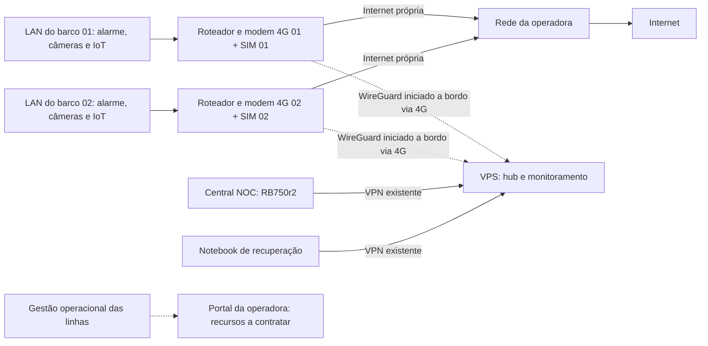

# Arquitetura da solução

**Direção confirmada pelo usuário em 29/09/2026:** cada barco terá modem 4G e chip próprios. A dificuldade de posicionar antenas e passar infraestrutura ao longo da costa motivou a retirada da central terrestre de distribuição de Internet. Chips poderão ser fornecidos pela operação, com gestão individual contratada; Vivo é a candidata provável, sem contratação ou cobertura homologadas.

**Estado:** revisão documental. VPS, stack, notebook e VPN da RB750r2 conservam as evidências anteriores; nenhum kit 4G foi implantado ou testado nesta revisão. Ver [estado real](../00-project/IMPLEMENTATION_STATUS.md) e [ADR-022/023](DECISIONS.md).

## Topologia de destino

```mermaid
flowchart LR
  A[LAN do barco 01: alarme, câmeras e IoT] --> R1[Roteador e modem 4G 01 + SIM 01]
  B[LAN do barco 02: alarme, câmeras e IoT] --> R2[Roteador e modem 4G 02 + SIM 02]
  R1 -->|Internet própria| OP[Rede da operadora]
  R2 -->|Internet própria| OP
  OP --> NET[Internet]
  R1 -.->|WireGuard iniciado a bordo via 4G| VPS[VPS: hub e monitoramento]
  R2 -.->|WireGuard iniciado a bordo via 4G| VPS
  NOC[Central NOC: RB750r2] -->|VPN existente| VPS
  NB[Notebook de recuperação] -->|VPN existente| VPS
  OPS[Gestão operacional das linhas] -.-> PORTAL[Portal da operadora: recursos a contratar]
```

As linhas pontilhadas são caminhos lógicos propostos. A VPN passa pelo acesso 4G; não é conexão física adicional. Repetir o kit e a identidade por barco até 20. O roteador e modem podem ser integrados ou equipamentos separados, conforme seleção e ensaio. A RB750r2 é administração; não distribui Internet aos barcos. A VPS centraliza gerência e observação.

## Responsabilidades e fluxos

| Elemento | Responsabilidade | Estado |
|---|---|---|
| Modem e SIM por barco | Acesso 4G individual, registro na operadora e sessão de dados | Seleção/contratação pendentes |
| Roteador embarcado | DHCP/DNS local, firewall, NAT IPv4 na WAN, VPN e política de tráfego | Integrado ao modem se atender; caso contrário, separado |
| WiFi/Ethernet local | Conectar kit de segurança e clientes autorizados | Cobertura interna e segregação a testar |
| Operadora | Transporte celular e recursos contratados de gestão de cada linha | Vivo provável; plano, franquia e controles a confirmar |
| VPS e stack | Hub WireGuard, coleta, histórico, painéis e alertas técnicos | Infraestrutura existente; coleta embarcada pendente |
| Central NOC/notebook | Administração autorizada através da VPS | Caminhos existentes preservados |
| Central de alarme/câmeras | Alarme e gravação locais; acesso remoto sob demanda | Modelos e autonomia pendentes |

1. Internet: LAN N → roteador/NAT WAN N → modem/SIM N → operadora → Internet. Não há core compartilhado nem passagem obrigatória pela VPS.
2. Administração: operador autorizado → VPN da central NOC ou notebook → VPS → peer exclusivo N → gerência do kit N. Aplicar rotas de retorno e ACLs nos dois lados.
3. Coleta: container autorizado → SNAT restrito no host para `10.250.0.1` → peer N → alvo permitido. Confirmar origem real antes do aceite.
4. Vídeo: gravação embarcada; aplicativo/nuvem ou acesso autorizado sob demanda. Tráfego de vídeo consome a franquia do barco; a VPS não será NVR nem relay permanente.
5. Gestão de SIM: portal ou API contratada → linha individual. Essa gestão não exige rotear Internet dos barcos pela VPS. Recursos exatos estão em [conectividade celular](../02-implementation/CELLULAR_CONNECTIVITY.md).
6. IoT proposto: sensores de bateria/fumaça/bomba → gateway embarcado → MQTT autenticado pela VPN → broker a implantar → Zabbix/Grafana. Comando da bomba usa serviço separado com autorização, expiração e confirmação física; automático local independe da rede. Liberar aos kits apenas o endpoint de telemetria necessário, sem acesso administrativo. [Pesquisa e desenho detalhado](IOT_MONITORING_RESEARCH.md).

## Confiança e continuidade

Cada barco tem LAN e chave VPN exclusivas. Bloquear comunicação lateral entre peers e LANs na VPS e nos roteadores; negar acesso dos barcos à administração e aos painéis. CGNAT não substitui firewall. A política IPv6 deve ser equivalente ou o encaminhamento deve permanecer desabilitado até homologação.

| Falha | Impacto previsto | O que deve continuar |
|---|---|---|
| Modem/SIM/franquia de N | Acesso remoto e Internet de N | Outros barcos; alarme/gravação locais de N conforme autonomia |
| Rede da operadora ou célula compartilhada | Pode atingir vários barcos simultaneamente | Funções locais alimentadas; independência física não elimina falha comum da operadora |
| VPS/hub | Perda de gerência/coleta central | Internet direta de cada barco e funções locais |
| Internet da central NOC | Administração por esse local | Internet embarcada e coleta na VPS |
| Roteador ou energia do barco | Rede local/remota do kit afetado | Alarme autônomo e gravação somente conforme alimentação e arquitetura ensaiadas |

Não há redundância celular confirmada. Dual-SIM, segunda operadora e antena LTE externa são evoluções condicionadas à necessidade medida. O dual-WAN da central NOC continua escopo administrativo separado.

## O que foi substituído

Saem do desenho de distribuição: provedor fixo da margem, core RB750Gr3 obrigatório, mANTBox, enlace 5 GHz margem–barco, VLANs e /30 de trânsito RF. A RB750Gr3 disponível pode servir à bancada ou a um kit, mediante inventário; wAP ax só será reavaliado como AP local se necessário. Equipamento existente não é descartado nem reconfigurado por esta documentação.

O [IPAM](NETWORK_PLAN.md), os [requisitos](../00-project/REQUIREMENTS.md), a [PoC](../06-validation/POC_PLAN.md) e o [modelo comercial](../07-service/COSTS_AND_COMMERCIAL_MODEL.md) passam a seguir acesso celular individual. NOC-Agent continua evolução opcional de leitura.
