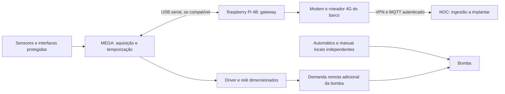

# Protótipo IoT com Arduino e Raspberry Pi disponíveis

Revisão de 29/09/2026. **Confirmado:** usuário possui Arduino UNO, Arduino MEGA e Raspberry Pi 4 Model B, sem sensores, para laboratório/campo e deseja avaliar menor custo. Usuário também possui conversor step-down LM2596 ajustável com display e módulo GSM/GPRS informado como “SIMBOL800L”, possivelmente SIM800L. **Pendente:** identificação exata do modem e das placas conversoras, revisões de UNO/MEGA, fonte/acessórios e inventário elétrico do barco. **Proposta:** reutilizar essas placas antes de adquirir gateway; não há firmware, ligação elétrica, serviço ou ensaio executado. Complementa a [pesquisa IoT](IOT_MONITORING_RESEARCH.md), preservando REQ-31 a REQ-34 e IOT-01 a IOT-05.

## Caminho de menor desembolso para começar

Usar **Arduino MEGA como controlador de aquisição e temporização**, **Raspberry Pi 4B como gateway MQTT e registro local**, ligados por USB serial após conferir alimentação/compatibilidade. Deixar o UNO como bancada auxiliar; não há necessidade de três placas no mesmo kit. A preferência pelo MEGA é proposta de organização do protótipo, não requisito de capacidade: o UNO também pode atender uma versão reduzida. Revisões/pinagem precisam ser conferidas antes da montagem. Fontes: [UNO R3 como referência](https://docs.arduino.cc/hardware/uno-rev3/) e [MEGA 2560 como referência](https://docs.arduino.cc/hardware/mega-2560).

Não comprar outro gateway para começar. O Pi 4B possui Wi-Fi/Ethernet; o roteador 4G continua responsável pela conectividade do barco. Um protótipo apenas com Pi também pode ler monitores I²C, mas a proposta com MEGA separa aquisição/temporização do processo Linux. Isso não torna o MEGA dispositivo de segurança: boia, automático e alarme locais continuam independentes de ambas as placas.

Pico/Pico W ou microcontrolador com rede ficam como comparação futura de consumo, não como inventário disponível. [Família Pico](https://www.raspberrypi.com/products/raspberry-pi-pico/).

Diagrama funcional, não esquema de ligação. Manter identidade, qualidade, timestamps e política de comandos definidos na pesquisa principal. O Arduino expõe sequência/identificador de boot e tempo monotônico; o gateway registra recebimento e qualidade da sincronização. Sem relógio sincronizado, não fabricar horário de origem. Comandos carregam validade; timeout local e perda do vínculo removem somente a demanda remota. Reset ao abrir a serial, desconexão USB e reinício do gateway não podem provocar partida.

## Bateria sem monitor comercial completo

| Caminho | O que entrega | Trabalho adicional |
|---|---|---|
| INA226 + shunt adequado | Tensão, corrente bidirecional e potência por I²C | Integrar corrente ao longo do tempo, calibrar e implementar persistência/SoC |
| INA228 + shunt adequado | Medições e acumuladores de carga/energia no chip | Ler acumuladores, tratar reset/overflow e modelar SoC/calibração |
| SmartShunt + placa disponível como gateway | Monitor de bateria com funções prontas e VE.Direct | Adaptar interface; maior custo do monitor, menor desenvolvimento dessa medição |

O INA226 aceita barramento de 0–36 V, usa ADC de 16 bits e consome 330 µA típicos no chip. O erro de ganho máximo declarado de 0,1% não é a precisão total da montagem. [TI, datasheet Rev. C](https://www.ti.com/lit/ds/symlink/ina226.pdf). O INA228 oferece ADC de 20 bits, acumuladores e consumo típico de 640 µA; resolução não significa precisão de SoC. [TI, INA228](https://www.ti.com/product/INA228). Ambos exigem alimentação lógica apropriada, independentemente da tensão que conseguem medir.

Preferir shunt externo dimensionado e ligações de medição Kelvin para correntes elevadas. Não passar corrente de motor de partida ou bomba desconhecida pelo shunt, terminais ou trilhas de um módulo pequeno. Verificar faixa diferencial, picos, aquecimento, tolerância/deriva do shunt, ruído e proteção contra transientes; a faixa do chip não garante a capacidade da placa. Shunt sobredimensionado pode piorar a leitura de correntes pequenas. A ligação do circuito de medição e sua referência não podem criar bypass do shunt por USB/terra de outro equipamento; escolher isolamento/referência conforme o circuito real.

SoC requer corrente de todas as cargas/carregadores do banco, capacidade útil, eficiência, sincronização e tratamento de lacunas. Começar com V/A/W e Ah acumulados; exibir percentual desconhecido até validar o cálculo e o ponto inicial. Ah acumulados desde o boot não são capacidade restante. Temperatura interna do INA228 não é temperatura da bateria.

## Fumaça e bomba

Reaproveitar o detector DFC 421 UN com central/sirene independente ou detector equivalente adequado ao ambiente. A placa lê o estado por interface protegida/supervisionada. Sensor genérico de gás não substitui detector de fumaça nessa instalação. Preservar alarme local sem Raspberry, Arduino ou NOC.

Medir a corrente da bomba em canal separado do monitor geral, com shunt/monitor ou Hall dimensionado, e adicionar entrada de nível alto. Acionar por driver e relé/contator adequado à carga DC e à partida; GPIO não alimenta bomba ou bobina diretamente. Levantar o circuito existente antes de escolher contatos/interfaces. O comando remoto permanece adicional ao automático e manual locais. A pinagem e os módulos de interface serão definidos após conferir as revisões das placas e o circuito elétrico escolhido.

## Consumo e custo

Arduino/Pico como microcontrolador é caminho candidato para reduzir consumo contínuo; Raspberry Linux facilita integração, logs e manutenção do protótipo. Não atribuir um único consumo a essas famílias. Como referência de catálogo, Raspberry Pi 4B tem corrente típica ativa da placa de 600 mA: a 5,1 V são aproximadamente 3,06 W e 73,44 Wh/dia, antes dos periféricos e perdas. Isso já supera a meta proposta de 1 W para telemetria, mesmo sem modem. Não é consumo medido da placa do usuário. [Tabela oficial de energia Raspberry Pi](https://www.raspberrypi.com/documentation/computers/raspberry-pi.html#power-supply).

Alimentar por conversor DC-DC protegido dimensionado para a placa e periféricos. Não ligar 12 V nos pinos lógicos/USB, nem adotar o regulador linear de uma placa como solução embarcada sem ensaio térmico. Medir consumo na entrada de 12 V em repouso, tráfego, boot e comando; incluir LEDs, interfaces, perdas e relés. Em Raspberry Linux, testar recuperação após corte e integridade do armazenamento. Comparar o conjunto de duas placas com microcontrolador conectado diretamente antes de decidir o kit da frota.

As três placas existentes dispensam compra de controlador/gateway no laboratório; apenas MEGA e Pi 4B compõem o protótipo proposto. Incluir custo de reposição na frota. Referência de placa INA228 Adafruit: **US$ 14,95** exibidos no [guia do fabricante](https://learn.adafruit.com/adafruit-ina228-i2c-power-monitor?view=all) em 29/09/2026; sem frete/impostos. Essa placa não é monitor completo nem solução pronta para alta corrente. INA226 e shunt externo ainda sem cotação validada. Acrescentar conversor/proteção, detector/alarme, nível, canal da bomba, driver/relé, conectores/caixa e horas de calibração/desenvolvimento. Economia de hardware é hipótese; custo instalado e manutenção precisam de comparação COM-01.

## Sequência de bancada e campo

1. Conferir revisões do UNO/MEGA, fontes, interfaces, correntes e componentes disponíveis; registrar ausência de sensores e conferir níveis lógicos. Selecionar arquitetura e fechar lista de materiais/esquema antes de firmware específico.
2. Na bancada, usar fonte limitada e carga de teste dimensionada: medir V/A/W, calibrar zero/ganho e direção, validar leituras pequenas e recarga (IOT-01). Dados de carga de teste devem estar identificados como bancada.
3. Integrar detector/alarme, nível e saída inicialmente em carga de teste; ensaiar reset, cabo USB, perda de processo/energia, duplicação e expiração de comando (IOT-02/04). Saída remota inativa no boot; automático local independente.
4. Integrar MQTT e registrar origem/idade, reconexão, consumo, lacunas e persistência (IOT-05). Sem inferir SoC válido a partir de uma sessão curta.
5. Somente após inventário e preparação operacional, testar bomba real em condição hidráulica apropriada, sem interromper automático (IOT-03); depois ensaiar campo/4G, energia e custo. Nenhum destes passos está executado.

## Aquisição incremental proposta

- **Primeiro lote, medição em bancada:** um monitor INA226 ou INA228 com documentação/esquema, shunt adequado à carga de teste, cabos/terminais, fonte limitada e referência de medição. O INA228 Adafruit tem exemplos Arduino/Python publicados e preço de referência acima; cotar INA226 para comparar menor desembolso. Não comprar simultaneamente os dois sem necessidade de comparação.
- **Segundo lote, eventos e comando:** detector DFC 421 UN com alarme local compatível, boia de nível, segundo canal de corrente da bomba e interface de saída. Começar a saída com carga de teste; relé/contator de potência somente após conhecer a bomba.
- **Campo:** avaliar o LM2596 disponível e selecionar conversão 12 V para alimentação do Pi/MEGA conforme ensaio, proteção contra transientes/inversão, fusíveis, caixa/vedação e conectores adequados. Fonte USB de bancada não comprova adequação ao barco. Dimensionar para picos, não só para o consumo médio de catálogo.

Não há sensores adquiridos, orçamento fechado ou autorização de compra nesta revisão. O reaproveitamento reduz desembolso inicial, mas o cálculo de SoC e a calibração permanecem trabalho do projeto.

## LM2596 com display e módulo GSM/GPRS disponíveis

**LM2596:** candidato à alimentação de bancada. A especificação de 3 A do CI não comprova a corrente contínua da placa recebida: indutor, diodo, capacitores, dissipação e montagem precisam de inspeção e ensaio. O regulador possui consumo próprio; incluir também o display na medição de energia. Fonte: [TI LM2596](https://www.ti.com/product/LM2596). O display auxilia ajuste, mas não substitui multímetro nem envia, por si só, telemetria ao NOC.

**Pi 4B:** usar inicialmente fonte USB-C adequada; referência oficial 5,1 V/3 A. Não presumir que o LM2596 disponível suporta o Pi, MEGA e periféricos juntos. [Fonte Raspberry Pi](https://www.raspberrypi.com/products/type-c-power-supply/). Ajustar o conversor sem as placas conectadas e conferir tensão com multímetro; depois testar carga, aquecimento, queda nos cabos e partida. Verificar ripple/transientes com instrumento apropriado antes do campo. Não paralelar saída do conversor com alimentação USB sem projeto para evitar retorno de corrente. Não se definiu ligação pelos pinos 5 V/VIN.

**Módulo GSM/GPRS:** tratar a identificação SIM800L como hipótese até conferir a placa. Se confirmado, é 2G e não atende ao requisito de modem 4G; aproveitar apenas para ensaios separados de comunicação, sujeitos a SIM/serviço/cobertura 2G disponíveis. Não presumir cobertura Vivo nem compatibilidade TLS/VPN. Não habilitar comando de bomba por SMS neste protótipo.

Para o SIM800L sem regulador de entrada, a referência é 3,4–4,4 V, recomendação de 4,0 V e picos de transmissão de até 2 A. Não alimentar VBAT diretamente em 5 V/12 V ou pela saída de alimentação do Arduino. Conferir também adaptação dos níveis UART; placa comercial pode ter regulador/interface próprios. [Manual SIMCom V2.02, cópia hospedada em repositório de datasheets](https://datasheet4u.com/pdf-down/S/I/M/SIM800H-SIMCom.pdf), seções 4.1 e 6. Não aplicar essa pinagem/faixa a uma placa ainda não identificada.

Se a placa LM2596 tiver uma saída regulada, ela não fornece simultaneamente as duas tensões diferentes do Pi e do modem. Propor fonte própria para o Pi e avaliar conversor separado para o ensaio GSM. Ajuste, corrente de pico e estabilidade devem ser medidos antes da conexão. O GSM não altera o caminho principal MEGA → Pi 4B → roteador 4G → NOC.
