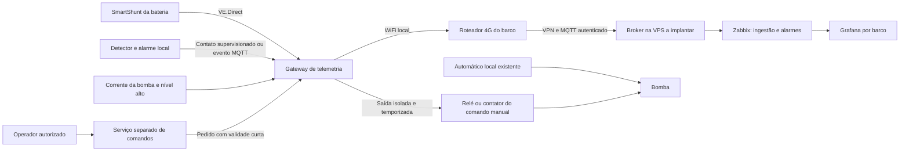

# Pesquisa IoT: bateria, fumaça e bomba de porão

Pesquisa em 29/09/2026. **Confirmado pelo usuário:** telemetria por barco no NOC; preferência por menor consumo, mais métricas, precisão e custo-benefício; sistemas geralmente 12 V, baterias veiculares comuns ou estacionárias, bombas de potência variável. O usuário deseja monitorar e, se possível, acionar a bomba remotamente. **Estado:** pesquisa e proposta, sem compra, firmware, broker, painel ou automação implantados. Modelos elétricos e local de instalação precisam de inventário por barco.

## Recomendação para o piloto

**Atualização com hardware disponível:** o usuário possui UNO, MEGA e Raspberry Pi 4B, sem sensores, para testes. Priorizar a [avaliação do protótipo com essas placas e INA226/INA228](IOT_LOW_COST_PROTOTYPE.md) para reduzir o desembolso de laboratório; SmartShunt permanece referência comercial de comparação, não compra obrigatória. Essa alternativa transfere calibração e cálculo de carga para o projeto.

**Melhor candidato entre os pesquisados para a bateria:** Victron SmartShunt IP65, ligado por VE.Direct a um gateway local. Avaliar 300 A ou 500 A conforme corrente contínua e partida, não pela capacidade em Ah. Para a frota, comparar dois caminhos: gateway próprio ESP32 com integração e manutenção sob nossa responsabilidade, ou Cerbo GX com funções de fabricante e maior custo inicial. A escolha de menor custo total depende do trabalho de desenvolvimento/instalação; placa barata não é kit pronto.

Para fumaça, Intelbras DFC 421 UN cabeado é candidato econômico quando integrado à central/sirene local compatível; Shelly Plus Smoke é alternativa com alarme próprio e menos cabeamento. Para a bomba, separar solicitação de acionamento, presença de corrente e condição da água. Propor sensor de corrente DC, sensor independente de nível alto e saída de comando isolada para relé/contator dimensionado ao motor.

O piloto recomendado combina SmartShunt + gateway ESP32 + DFC 421 UN/alarme local + sensor de corrente da bomba + nível alto. Seleção condicional ao ambiente: DFC e Shelly são produtos de uso interno/residencial, sem homologação marítima específica comprovada nesta pesquisa. Não extrapolar para casa de máquinas, condensação ou locais com vapores de combustível.

## Comparação técnica

| Candidato | Dados e integração documentados | Consumo/precisão declarados | Avaliação para a Guarderia |
|---|---|---|---|
| Victron SmartShunt IP65 | Tensão, corrente, potência, Ah, SoC estimado, autonomia e histórico; VE.Direct/Bluetooth | Eletrônica < 1 mA; tensão ±0,3%, corrente ±0,4%; offset < 10 mA nos modelos 300/500 A | Preferido para bateria: interface aberta e baixo consumo; precisa gateway e instalação do shunt |
| Renogy Battery Shunt 300 | SoC, corrente, temperatura, tensão auxiliar; BLE/BLE Mesh e ecossistema ONE/DC Home | < 0,1 W; corrente ±1% | Alternativa, mas acesso documentado ao NOC menos direto nas fontes consultadas; não presumir MQTT/Modbus |
| Shelly Plus Uni | Voltímetro, entradas/saídas e MQTT/RPC; mede tensão, não SoC ou corrente por si só | < 1 W; entrada 0–15/0–30 V; precisão do voltímetro não preenchida na ficha consultada | Bom módulo de I/O pronto para protótipo; não substitui monitor de bateria |
| Intelbras DFC 421 UN | Detector óptico, contato NA/NF para central/gateway | < 0,1 mA em supervisão; alarme 30 ±5 mA; 10–30 V | Menor preço observado para fumaça cabeada; exige alarme local e supervisão do circuito |
| Shelly Plus Smoke | Fotoelétrico com sirene, bateria, MQTT e eventos de alarme | CR123A própria; fabricante declara até 5 anos com bateria original | Menos instalação e sem dreno contínuo da bateria do barco; verificar latência de despertar/reconexão |
| Pololu ACS724LLCTR-30AU, placa 4046 | Corrente DC 0–30 A, saída analógica 133 mV/A em 5 V | 10 mA típico, 14 mA máximo em 5 V | Candidato barato para bancada da bomba; precisa ADC/condicionamento/calibração e adequação à corrente real |
| Segundo SmartShunt em modo DC Energy Meter | Corrente/potência/energia de um circuito | Mesma família de medição; não é um segundo SoC nesse modo | Opção de maior custo para medir a bomba com interface digital e consumo eletrônico menor |

Fontes técnicas por linha: [Victron IP65](https://www.victronenergy.com/media/pg/SmartShunt_IP65/en/technical-data.html), [Renogy](https://www.renogy.com/products/renogy-battery-shunt-300), [Shelly Uni](https://www.shelly.com/products/shelly-plus-uni), [Intelbras, ficha técnica](https://backend.intelbras.com/sites/default/files/2025-09/Datasheet_DFC%20421UN%20-%20Arquivo%20Final%2023.09.25.pdf), [Shelly Smoke](https://kb.shelly.cloud/knowledge-base/shelly-plus-smoke), [Pololu, especificações](https://www.pololu.com/product/4046/specs) e [Victron, modo DC](https://www.victronenergy.com/media/pg/SmartShunt/en/all-features-and-settings.html). Valores declarados não são medições do kit.

### Bateria: alcance e limites

SoC é cálculo baseado na corrente acumulada e parâmetros da bateria, não leitura direta de tensão nem saúde/capacidade real garantida. Cadastrar química exata, Ah, envelhecimento conhecido e parâmetros de carga; “estacionária” não identifica sozinha todos esses parâmetros. Sincronizar conforme o fabricante e exibir SoC desconhecido quando não válido. Resolução de 0,1% no mostrador não significa precisão absoluta de 0,1% da carga. [Operação e sincronização Victron](https://www.victronenergy.com/media/pg/SmartShunt/en/operation.html).

Monitorar o banco escolhido com todas as cargas/carregadores relevantes atravessando o shunt conforme o projeto elétrico. Levantar motor de partida, alternador, bombas e inversor antes de escolher faixa. A entrada auxiliar mede tensão de outro banco **ou** temperatura com sensor opcional **ou** ponto médio; não entrega SoC de uma segunda bateria e essas funções não são simultâneas. [Configuração](https://www.victronenergy.com/media/pg/SmartShunt/en/configuration.html).

VE.Direct transmite leituras a cada segundo e tem integração própria documentada; o gateway pode ler sem emitir comandos para o monitor. Não é RS-485/Modbus nativo. Adaptar nível lógico e isolamento corretamente; WiFi não existe no SmartShunt. [Interface do fabricante](https://www.victronenergy.com/media/pg/SmartShunt_IP65/en/interfacing.html). Há [componente comunitário ESPHome](https://github.com/syssi/esphome-victron-vedirect), candidato sujeito a revisão, versão fixada e teste; não foi executado nem é suporte oficial Victron.

### Fumaça: alarme é diferente de concentração

O DFC entrega estado de alarme por contato, não concentração em ppm ou percentual de fumaça. Seus limites incluem ambiente interno, -10 a 50 °C e umidade sem condensação <95%. A saída de contato suporta no máximo 30 V/100 mA: não alimentar sirene por ela sem interface apropriada. Central/sirene e reset devem funcionar localmente conforme manual, mesmo sem gateway/NOC. A supervisão deve distinguir alarme de falta de alimentação/fio rompido; contato simples sem circuito supervisionado não oferece essa distinção. [Intelbras](https://www.intelbras.com/pt-br/detector-de-fumaca-convencional-dfc-421-un/).

No Shelly Plus Smoke, usar publicação de eventos MQTT/webhook e estado de bateria; não depender de polling contínuo de dispositivo que dorme. A documentação do componente expõe alarme e silenciamento, não densidade de fumaça. Validar entrega ao broker ao despertar e funcionamento da sirene sem rede; não permitir silenciamento remoto automático pelo NOC. [API Smoke](https://shelly-api-docs.shelly.cloud/gen2/ComponentsAndServices/Smoke/) e [fabricante sobre dispositivos em repouso](https://kb.shelly.cloud/knowledge-base/smart-home-starter-kit).

Não substituir detector de incêndio por módulo genérico de gás de bancada. Se ambiente exigir equipamento marítimo específico, cotar solução adequada ao compartimento em etapa própria; esta seleção não comprova certificação para esse uso.

### Bomba: três observações distintas

- **Solicitada:** comando remoto ou automático local pediu funcionamento.
- **Energizada/consumindo:** tensão/corrente detectadas no circuito, independentemente da origem do comando.
- **Drenagem observada:** água deixa o nível alto ou baixa conforme sensor/inspeção; corrente não prova vazão, rotor livre ou mangueira desobstruída.

O ACS724 é componente de integração, não sensor IP marítimo acabado. Sua placa conduz a corrente em série, embora a medição tenha isolamento galvânico; confirmar pico de partida, aquecimento, terminais e proteção antes de qualquer uso no circuito de bomba. ADC, referência de tensão, ruído, offset e temperatura compõem o erro final, que não foi medido. Saída de até cerca de 4,5 V não vai diretamente a GPIO/ADC de 3,3 V. [Placa Pololu](https://www.pololu.com/product/4046).

Como alternativa de nível, avaliar boia náutica independente, por exemplo Rule-A-Matic 35A, cuja família tem especificação de instalação do fabricante. Usá-la como entrada de nível requer verificar corrente mínima de contato/condicionamento; não presumir leitura confiável com qualquer pull-up. Uma boia indica cruzamento de limiar, não centímetros de água ou litros bombeados. Preservar sensor/automático originais. [Rule/Xylem](https://www.xylem.com/siteassets/brand/rule/resources/technical-brochure/rule-a-matic-float-switch-technical-datasheet.pdf).

## Gateway, custo e consumo total

| Caminho | Benefício | Limite |
|---|---|---|
| Seeed XIAO ESP32-C3 + interfaces | Candidato econômico: UART para shunt, I/O e WiFi no mesmo gateway | Placa de desenvolvimento: requer fonte protegida, isolamento, ADC externo se necessário, caixa, firmware, watchdog, buffer e homologação |
| Cerbo GX MK2 | Integração Victron, I/O e serviços locais de MQTT/Modbus TCP documentados | Maior preço; consumo total e capacidade das entradas/saídas a conferir no modelo/firmware, sem ligação direta de motor |
| Shelly Plus Uni/1 Gen3 | I/O e comando com firmware pronto e protocolos documentados | Não lê VE.Direct nativamente como solução pronta; pode exigir outro gateway para a bateria |
| Sensar Marine | Sistema comercial com monitoramento de bateria/porão e conectividade própria | SIM gerido pelo fornecedor e assinatura; API para nosso NOC e acionamento não comprovados nesta pesquisa; não usa automaticamente nosso chip |

A XIAO tem referência de 75 mA em WiFi ativo e 25 mA em modem-sleep nas condições publicadas; dezenas de µA de deep sleep não descrevem um gateway continuamente disponível. O kit montado e seu firmware precisam ser medidos. [Seeed, especificações](https://wiki.seeedstudio.com/XIAO_ESP32C3_Getting_Started/). Cerbo oferece entradas configuráveis para fumaça/porão e serviços de integração; isso não significa automação de bomba já pronta para esta aplicação. [Manual GX](https://www.victronenergy.com/media/pg/Cerbo_GX/en/configuration.html). Sensar tem SIM não substituível pelo usuário e política própria de transmissão; é alternativa comercial de referência, sem equivalência presumida ao NOC. [FAQ Sensar](https://sensarmarine.com/en-us/faq).

Em 12 V, <1 mA equivale a <0,288 Wh/dia para a eletrônica do SmartShunt; <0,1 mA equivale a <0,0288 Wh/dia do DFC em supervisão. O Hall a 5 V/10 mA típicos corresponde a 1,2 Wh/dia antes das perdas da fonte. São cálculos a partir de catálogo, não autonomia medida; incluem-se separadamente dissipação do shunt, conversão, sirene, relés e tráfego. Gateways e modem 4G podem dominar o consumo; não atribuir o consumo do sensor ao kit inteiro.

Meta técnica proposta: medir e buscar até 1 W médio na telemetria básica em repouso, excluindo modem 4G, sirenes e potência da bomba, **sem prometer que o primeiro protótipo atingirá essa meta**. Mesmo 1 W contínuo representa 24 Wh/dia, ou 2 Ah/dia ideais em 12 V. Registrar consumo na bateria para incluir perdas reais.

## Preços encontrados e condições

Referências acessadas em 29/09/2026; preços de catálogo/páginas, sem carrinho, frete, garantia local ou impostos finais conferidos. Não converter moeda nem somar anúncios internacionais como custo entregue. Estoques são declarações das páginas consultadas.

| Item | Preço de referência | Fonte e condição |
|---|---:|---|
| SmartShunt IP65 300 A | US$ 80 | [Lista Victron 2026-Q3, p. 13](https://latam.victronenergy.com/pricelist), USD C, sem VAT; não cotação brasileira |
| SmartShunt IP65 500 A | US$ 112 | Mesma lista, p. 13 |
| Cerbo GX MK2 | US$ 278 | Mesma lista, p. 10; cabos/tela não incluídos nesta comparação |
| SmartShunt IP65 500 A em marketplace brasileiro | R$ 1.131,60 na página aberta | [Magalu/nocnoc](https://www.magazineluiza.com.br/monitor-de-bateria-victron-energy-smartshunt-ip65-bluetooth/p/gjj3f39abj/au/caba/); importação; busca mostrou R$ 880,32 divergente, preço final não confirmado |
| DFC 421 UN | R$ 65,33 | [Sinalert](https://loja.sinalert.com.br/dfc-421-un-detector-de-fumaca-convencional-intelbras), página indica disponível; verificar base/acessórios no fornecimento |
| Shelly Plus Smoke | € 42,90 | [Loja do fabricante](https://www.shelly.com/products/shelly-plus-smoke-alarm-1), unidade; não preço entregue no Brasil |
| Shelly Plus Smoke no Brasil | R$ 415,36 no Pix, indisponível no resultado consultado | [AV Controls](https://avcontrols.com.br/products/shelly-plus-detector-de-fumaca); referência indexada, abertura direta não recuperada; não orçamento de compra |
| Shelly Plus Uni | R$ 234,45 na página aberta | [Magalu/nocnoc](https://www.magazineluiza.com.br/modulo-inteligente-shelly-plus-uni-wifi-bluetooth-com-contatos-secos/p/dak7d50306/cj/asoc/), compra internacional; busca mostrou R$ 235,35 |
| XIAO ESP32-C3 | US$ 4,99 | [Seeed](https://www.seeedstudio.com/Seeed-XIAO-ESP32C3-p-5431.html), só placa, indicada em estoque |
| ACS724 0–30 A, placa 4046 | US$ 9,95 | [Pololu](https://www.pololu.com/product/4046), só placa; confirmar estoque/prazo |
| Renogy Shunt 300 | US$ 120,99 | [Renogy](https://www.renogy.com/products/renogy-battery-shunt-300), indisponível/backorder; gateway não incluído |
| Sensar Boat Monitor + Bilge Sentry | US$ 499 + assinatura desde US$ 10/mês no plano plurianual | [Sensar](https://sensarmarine.com/en-us/products); expansão para fumaça acrescenta hardware/custo |

Faltam cotações do conversor protegido, interfaces isoladas, ADC, cabos/terminais, caixa, relé/contator DC, sensor de nível, sirene/central, instalação e calibração. Total honesto por barco: componentes entregues + adaptação elétrica + horas de instalação + parcela do desenvolvimento/testes + manutenção. Nenhum valor completo foi fechado. Aproveitar central/sirene existentes só após inventário.

## Caminho até o NOC — proposta, não instalado

A variante Shelly Smoke publica diretamente no broker pela rede do barco; o gateway não deve criar dependência adicional para a sirene. MQTT/broker e serviço de comandos são componentes novos a especificar/implantar. O plugin MQTT do Zabbix Agent 2 pode consumir publicações, com TLS e checagens ativas conforme versão. [Integração oficial Zabbix](https://www.zabbix.com/integrations/mqtt). Fixar versão, política de persistência e ACL antes de produção.

### Métricas e tempo real propostos

| Grupo | Telemetria mínima | Frequência/latência alvo, ainda não medida |
|---|---|---|
| Bateria | V, A com sinal, W, Ah consumidos, SoC e sua validade, autonomia estimada, última sincronização quando disponível | Leitura local de 1 s; publicação agrupada a cada 5 s; apresentação NOC p95 até 10 s com WAN saudável |
| Fumaça | Alarme, falha de circuito/alimentação quando instrumentada, bateria do detector quando exposta, idade do último evento | Publicação imediata por mudança; alvo de chegada ao NOC p95 até 5 s, sem atrasar alarme local |
| Bomba | Corrente, estado derivado, partidas, duração atual/acumulada, nível alto, comando solicitado/aceito/confirmado | Captura local suficiente para não perder ciclos curtos; eventos imediatos + resumo de 5 s |
| Gateway | Uptime, última leitura, RSSI local se exposto, fila, boot_id, firmware e tensão de alimentação quando instrumentada | Heartbeat de 30 s; sem comunicação após 90 s como proposta |

“Tempo real” refere-se a essas metas sob conectividade, não garantia durante falta de 4G. Dashboard sempre mostra timestamp de origem/recebimento e atraso; bateria/estado periódico sem atualização por 15 s fica atrasado, não atual por causa de heartbeat. Sensor de fumaça adormecido tem política de idade própria conforme intervalo documentado/medido; não interpretá-lo como falha a cada 15 s.

Contrato lógico: `boat_id`, `asset_id`, `metric`, `value|null`, `unit`, `sampled_at`, `received_at`, `quality`, `sequence`, `boot_id`; contadores e histórico mantêm origem. Namespace proposto `guarderia/<boat_id>/telemetry|events|command|ack`. Credencial individual pode publicar apenas seu barco; o operador não acessa outros barcos sem permissão. Regras específicas liberam somente o broker pela VPN, sem abrir painéis administrativos aos kits.

Estado retido não pode parecer atual após reconexão. Buffer local persistente e reenvio preservando timestamp são requisitos a desenvolver/validar, não capacidades automáticas de qualquer firmware. QoS/retry não garantem histórico durante queda de energia. Telemetria armazenada pode ser reenviada; comandos expirados não. Broker confirma mensagem, mas somente a medição confirma o efeito físico.

Para dimensionar franquia: cenário matemático de payload agrupado de 500 bytes a cada 5 s resulta em 8,64 MB/dia, ou 259,2 MB/30 dias por barco, antes de MQTT/TCP/TLS/VPN, eventos e retransmissões. Medir bytes efetivos em DATA-01; não multiplicar chamadas por cada métrica sem contabilizar overhead.

## Acionamento remoto da bomba

Pedido confirmado pelo usuário, mas depende de projeto por barco. Manter boia/automático e comando manual local funcionais sem gateway, firmware, Internet ou VPS. O remoto adiciona solicitação ao circuito de comando permitido pelo fabricante; não inserir um relé de bloqueio geral que possa desligar a drenagem automática. Em bombas com eletrônica integrada, levantar interfaces reais antes de propor ligação.

Proposta de atuação: saída isolada → driver/relé de interface → contator ou relé de potência adequado a motor DC. Selecionar por corrente nominal **e** partida/travamento, tensão real de carga, capacidade de interrupção DC, ambiente e proteção. O Shelly Plus Uni limita sua saída a 300 mA/30 V: nunca alimentar o motor por ela. Shelly 1 Gen3 é alternativa pronta para **comando**, com contato seco e fonte estabilizada apropriada; também não é confirmação de corrente nem autorização para motor de qualquer potência. [Shelly 1 Gen3](https://www.shelly.com/products/shelly-1-gen3).

O comando terá ID único, barco, operador, motivo, duração máxima, expiração e confirmação de recebimento/efeito. Não usar comando MQTT retido nem fila persistente que acione o motor quando o link voltar. Rejeitar duplicado, expirado, relógio inválido, identidade incorreta ou telemetria insuficiente para a política definida. Não implementar botão remoto de desligamento do automático local.

A solicitação remota termina por timeout local, independentemente do NOC. Na perda da comunicação ou reboot, remover apenas essa solicitação; o automático continua livre para atuar. Limites não serão universais: duração e permissões dependem de ensaio da bomba. Watchdog/trava física e falha de contato colado exigem teste; configuração de auto-off isoladamente não comprova segurança do conjunto.

Alarmes derivados: pedido sem corrente; corrente persistente após fim do pedido e automático inativo; corrente fora do perfil medido; nível alto persistente; número/duração de ciclos anormais. Não diagnosticar obstrução somente por corrente e não estimar litros sem sensor/ensaio hidráulico.

## Bancada e critérios de decisão

IOT-01: calibrar tensão/corrente contra referência adequada em repouso, carga e recarga; validar SoC após sincronização/ciclo, ausência de bypass, configuração da bateria e erro nas correntes pequenas. Definir tolerância de ensaio conforme referência e soma dos erros antes de medir.

IOT-02: testar fumaça com método aprovado pelo fabricante, sirene independente de rede, reset, perda de alimentação e fio rompido; registrar o que a interface consegue distinguir. Não usar chama aberta para ensaio improvisado.

IOT-03: testar bomba em condição hidráulica apropriada, todas as origens de acionamento, sensor de corrente/nível e ciclos curtos; registrar nominal/pico e retorno real da água. Qualquer teste de falha mecânica depende do procedimento do fabricante.

IOT-04: testar comandos autenticados, duplicados, expirados, perda de 4G/NOC, reboot e travas locais. Provar que falha do remoto não bloqueia automático/manual local. Confirmar estado físico separadamente do ack.

IOT-05: medir energia do kit e idade dos dados no NOC, latência de evento, backlog, retomada e bytes por 24 h/7 dias. Ensaiar dois barcos para negar telemetria/comando cruzados. Registrar erro, lacunas e pior caso; medir objetivo energético no perfil realmente instalado.

Decisão de compra em lote somente após piloto e orçamento instalado. Não há medição ou homologação desses dispositivos na Guarderia nesta pesquisa.
